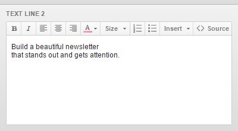
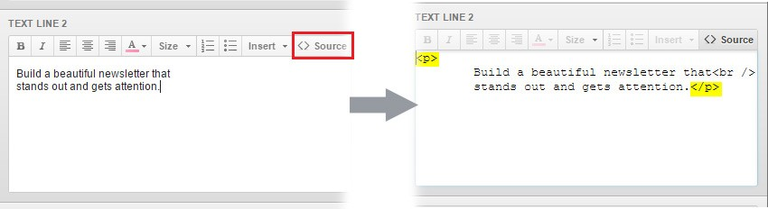

# Campaign Monitor

The Template includes a Campaign Monitor integration, which you can use with their builder.


## Structure

The Campaign Monitor-integrated files can be found in the ``Files/campaign-monitor`` folder from your download.

This folder has the same structure as the Files/html folder, only that all files inside it are editable or ready to use with Campaign Monitor

Only the all-in-one template .zip file from the ``Files/campaign-monitor/``all-in-one folder can be imported in Campaign Monitor. All others are just for creating a Campaign Monitor-compatible template yourself.

If you're planning on creating a Campaign Monitor template yourself, please first take a look at their documentation on [creating a custom template](https://www.campaignmonitor.com/create/), and then at our own templates to understand how to do it.

## Uploading

Inside the ``Files/campaign-monitor/all-in-one/`` folder, you'll find the all-in-one HTML and a .zip file with supporting images.

In Campaign Monitor, click your user name on the top right, then select "My Templates".

On the following page, click "Create New Template", then click the "Upload your own HTML" box. You will be asked to name your template, and then upload the HTML file and the images .zip file.

Browse for them on your computer, then click Add template.

## Supported Tags

The following Campaign Monitor tags, attributes, and variables are supported in Sartre Email:

#### Template Tags

- ``<repeater>``
- ``<layout label="...">``
- ``<singleline>``
- ``<multiline>``
- ``editable ``- attribute for images
- ``<webversion>``
- ``<unsubscribe>``

See the Campaign Monitor template tags [reference](https://www.campaignmonitor.com/create/editable-content/).

#### Personalization Variables

``[fullname] (fallback included)``

See the Campaign Monitor personalization tags [reference](https://www.campaignmonitor.com/create/editable-content/).

## Customisation

Visual template customisation in Campaign Monitor is very limited, you can only click to edit a section and have some basic formatting options, for multiline elements only!



For any customisation to the template, you will need to manually add it before uploading to Campaign Monitor.

## Limitations & Other Notes

Most visual email builders are limited in functionality, meaning they don't or can't allow fine-tuned control over the template as if you were to manually edit the HTML code. That being said, please take the following into account.

#### Conflicting Browser Plugins

The Grammarly browser plugin severely affects online email editors, including MailChimp. By injecting itself into the page, it corrupts email HTML, resulting in a broken template.

::: warning
Please disable any plugins such as Grammarly or AdBlock when using an online email builder. As a rule of thumb, we recommend disabling any plugins that manipulate content on a web page when using any of the integrations provided with our email templates.
:::

#### Hamburger Menu Icon

Just like in the MailChimp version, the hamburger menu icon is visible only on the mobile breakpoint, so it can't be edited with Campaign Monitor's visual editor. Instead, you need to edit it manually in the code, before uploading to Campaign Monitor:

``` html
<!--[if !mso 9]>
    
<![endif]-->
<div class="toggle-content">
```

##### Background Images

Campaign Monitor currently offers no support when it comes to editing background images.

Just like with the menu icon, manually edit the template code before uploading to Campaign Monitor. Make sure to set the image URL in both the inline CSS and in the ``src=""`` attribute for the ``<v:image />`` tag:

``` html
<table class="container" cellpadding="0" cellspacing="0" role="presentation" width="700">
    <tr>
      <td style="background-image: url('http://example.com/your-image.jpg'); background-color: #0CBACF; background-repeat: no-repeat; background-position: center; background-size: cover;">
        <!--[if gte mso 9]>
        <v:image src="http://example.com/your-image.jpg" xmlns:v="urn:schemas-microsoft-com:vml" style="width:600px;height:500px;" />
        <v:rect fill="false" stroke="false" style="position:absolute;width:600px;height:500px;">
        <div><![endif]-->
```

#### Font Size Differences

Campaign Monitor's editor inserts ``<p>`` tags in place of editable text areas. Because our email framework includes a typography reset, these injected tags will inherit the font size in the reset (usually 13px).

The problem is that you might be editing something like a large heading or subheading, and you will see them using a smaller font size than intended in Campaign Monitor.

To fix it, simply click to edit that text, and switch to "Source" view in Campaign Monitor's editor. There, remove the ``<p>``tags surrounding your text:



::: tip
Always test before you send!
:::

